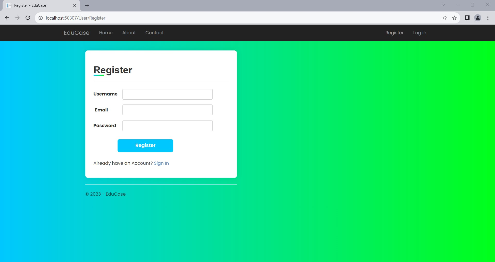
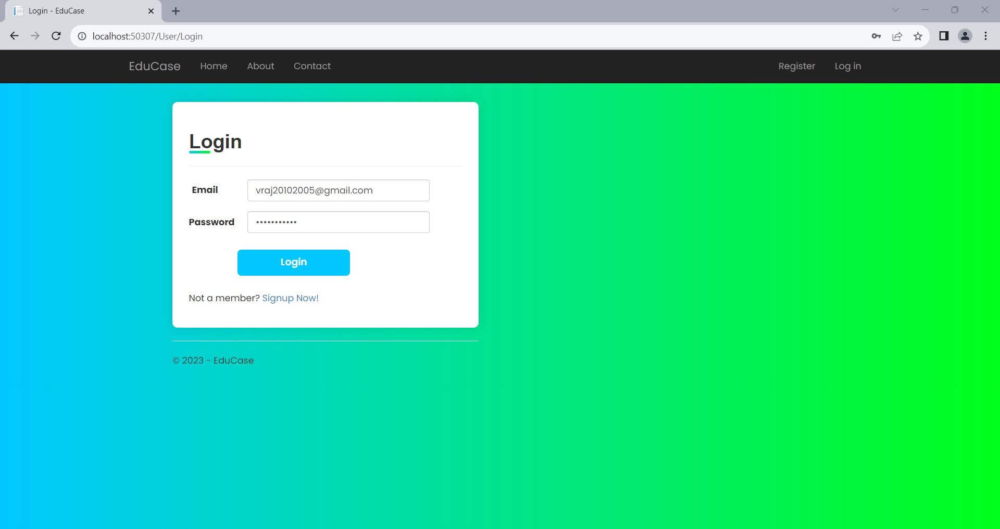
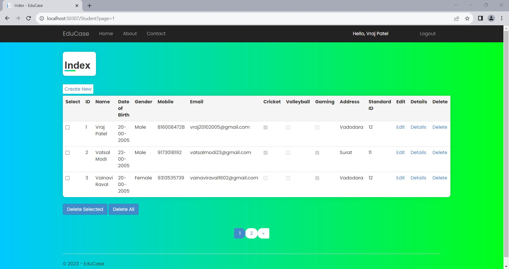
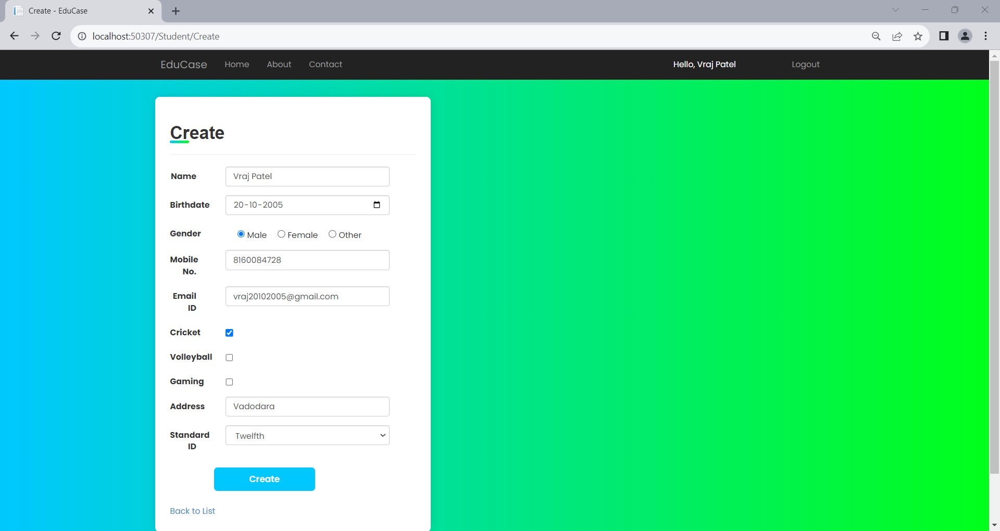
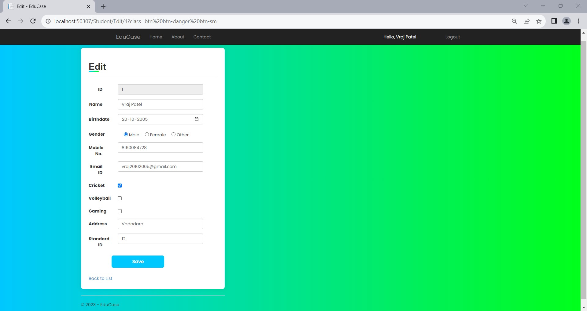
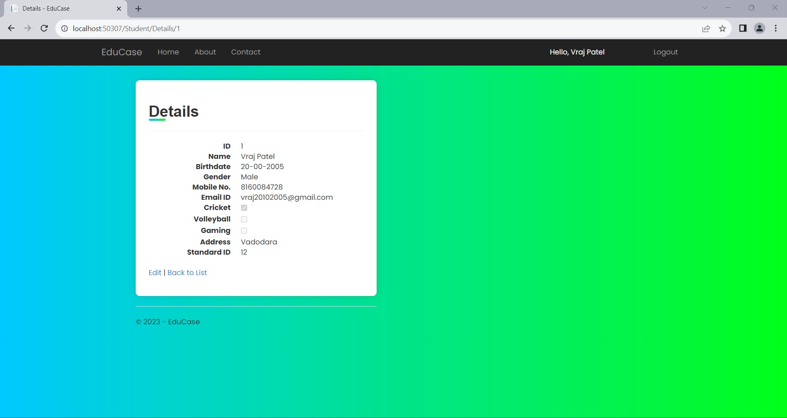

# EduCase - Student Management System

EduCase is a user-friendly Student Management System built with **.NET MVC** and **PostgreSQL**. The application is designed to efficiently handle student records with features like CRUD operations, validations, sorting, and pagination.

## Features

### 1. Input Form
The input form collects and validates student details:
- **Student ID**: Auto-incremented by the database.
- **Student Name**: Accepts only alphabetic characters (no numbers or special symbols).
- **Birthdate**: Input through a date picker.
- **Gender**: Selectable via radio buttons (Male/Female).
- **Standard**: Dropdown options (Junior, Senior, or 1 to 12).
- **Mobile Number**: Accepts exactly 10 digits.
- **Email Address**: Validates common email formats.
- **Hobbies**: Multiple selection from checkboxes (Cricket, Volleyball, Gaming).
- **Address**: Multi-line text box for detailed information.

### 2. Display Records
- View all student records in a structured grid view.

### 3. Edit Records
- Modify existing student details through an intuitive edit form.

### 4. Delete Records
- **Single Record Deletion**: Displays confirmation ("Are you really want to delete the record?") before deletion.
- **Bulk Deletion**: Allows multiple records to be selected and deleted simultaneously.

### 5. Sorting
- Custom implementation of record sorting without using inbuilt functions.

### 6. Pagination
- Navigate through records using a custom paging system, avoiding inbuilt pagination methods.

---

## Tech Stack
- **Framework**: .NET MVC
- **Database**: PostgreSQL
- **Frontend**: HTML, CSS, JavaScript
- **Backend Language**: C#
- **Tools**: Visual Studio, PostgreSQL Database Manager

---

## How to Run

### Prerequisites
- Visual Studio with .NET MVC support.
- PostgreSQL installed and configured.
- Basic understanding of MVC architecture.

### Steps to Run
1. Clone this repository:
   ```bash
   git clone https://github.com/your-username/EduCase.git
   ```
2. Open the solution file (`EduCase.sln`) in Visual Studio.
3. Update the connection string in `appsettings.json` to match your PostgreSQL configuration.
4. Build the project and run the database migrations.
5. Launch the application using Visual Studio (IIS Express or Localhost).
6. Access the application in your browser at `http://localhost:port/`.

---

## Screenshots












---

Let me know if you need to add anything else!
